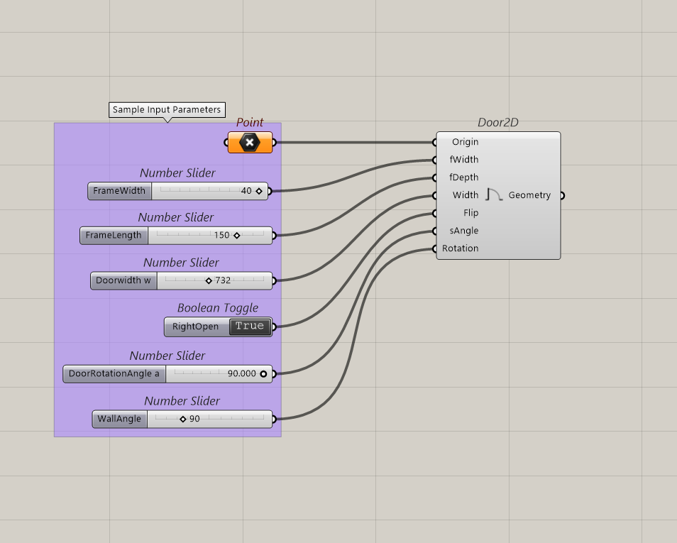
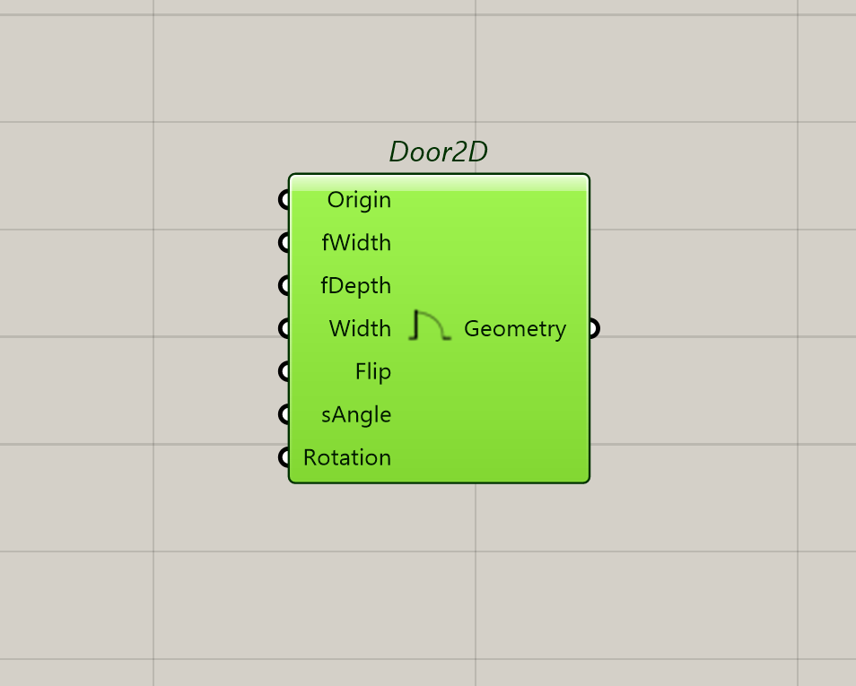

### Door2D Plugin

* Door2D as the name suggests is a plugin mainly for Architects working with 2D floor plan drawings. 
The plugin aims to fit door symbols in plan drawings with different scales, dimensions and other attributes.  

---

## 1. The plugin takes into consideration the following attributes- 
Position/ Origin of the door;
Orientation of the Door on the plan;
Width and Length of the door frames;
Rotation Angle of the door;

## 2. To create a door in the floor plan, select the origin point/position of the door opening and the respective parameters to orient the door according to the requirements.

