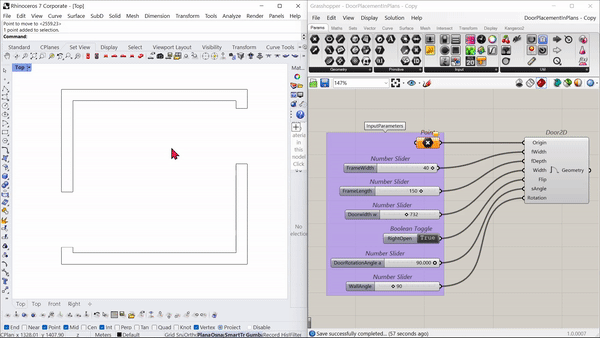

### Door2D Plugin

* A plugin that creates a 2D door that can be used on floor plan drawings. 

---

## 1. The plugin takes input parameters- 
Position/ Origin of the door;
Orientation of the Door on the plan;
Width and Length of the door frames;
Rotation Angle of the door;

