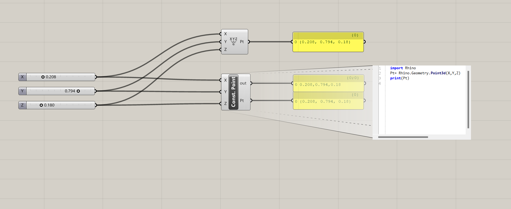
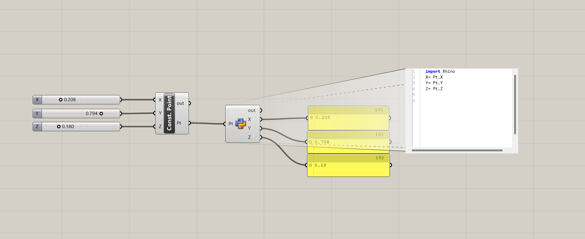
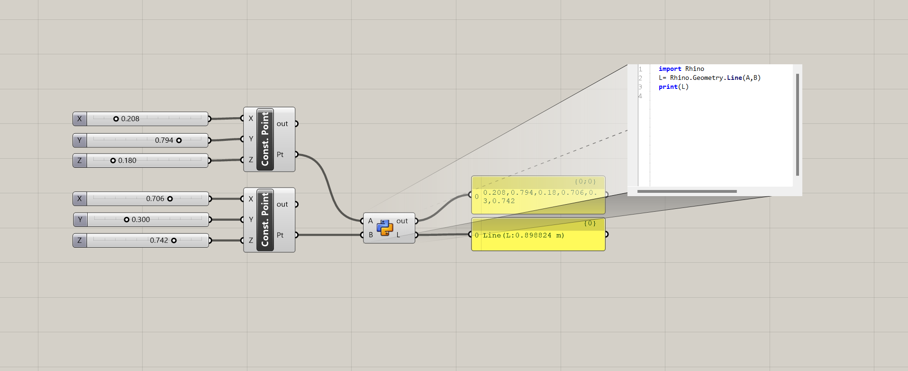
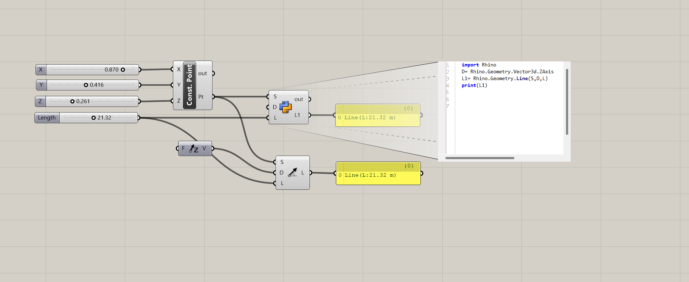

# Python Rhino
### Creating Python scripts inside Grasshopper.

* Recreated existing Grashopper components through custom Python scripts.

---

## 1. Construct Point Component

## 2. Deconstruct Point Component

## 3. Line Component

## 4. LineSDL Component

---
