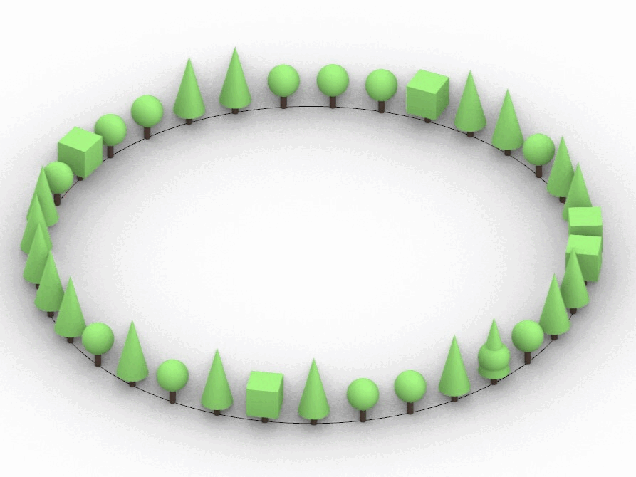
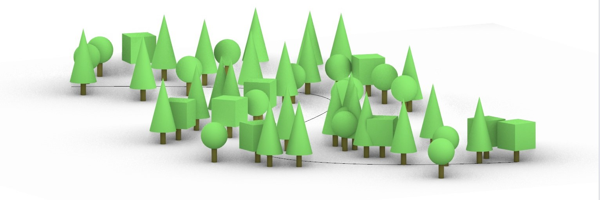

### TreeD Plugin

* TreeD is a plugin that emerged out of the idea to place landscape elements in a "controlled random" environment. The plugin requires a path that guides the placement/clustering of the landscape. Attributes like space jitter, path jitter and rotation helps create an irregular movement and variation in the placement of the trees/objects.

---

### The plugin takes the following attributes- 
* Curve or Path: This defines the guideline for the objects to follow. 
* Spacing: The spacing between the trees/plants in the landscape.
* Space Jitter: This is factor that helps create variations in the spacing between the trees.
* Path Jitter: The number set to this attribute creates random movement outside of the guided path.
* Rotation: Rotation helps change the orientation of the trees to help bring variation in the elevation.
* Trees: Connecting multiple tree/landscape object/geometry of choice helps create more variations in the output.

